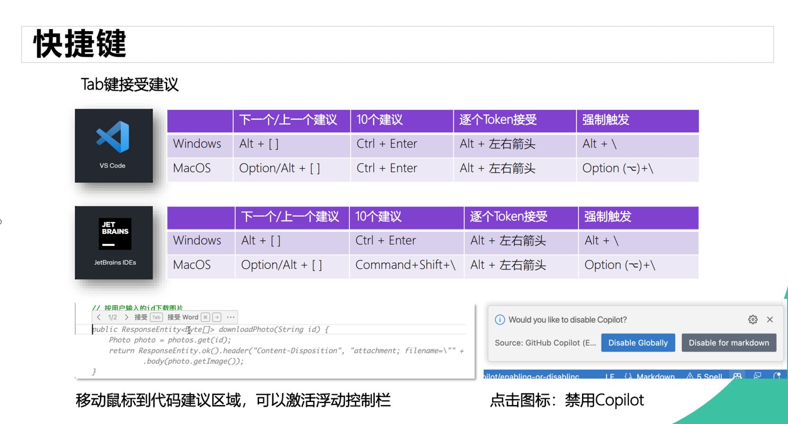
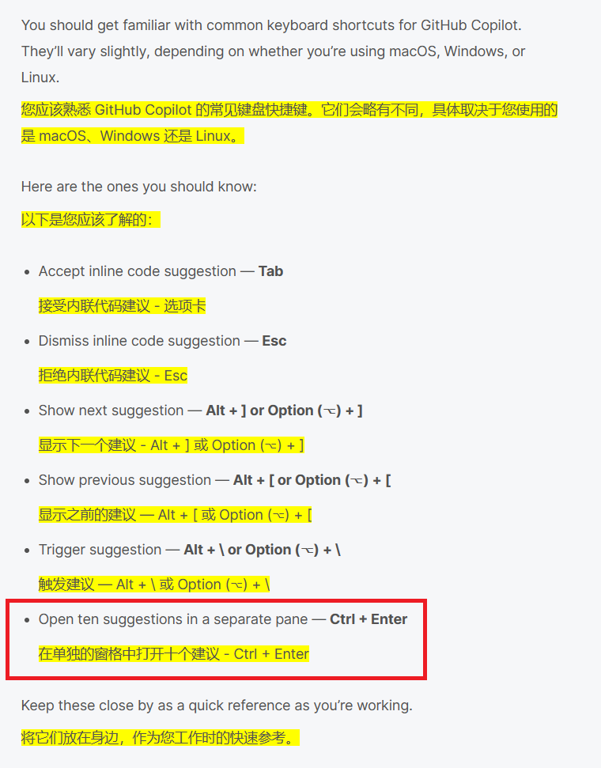

# Visual-Studio-GitHub-Copilot-Chat-Debugger-Aware

 ## GitHub Copilot 与 IntelliSense 和 IntelliCode 的对比
   
   - IntelliSense 是 Visual Studio 内置的一项代码完成功能，它根据当前上下文提供建议。 这类建议包括变量名称、函数和类。 IntelliSense 是特定于语言的，适用于一组有限的编程语言。

   - IntelliCode 是 Visual Studio 的一个扩展，它使用 AI 根据代码库中的模式提供更智能的整行补全功能。 它超越了 IntelliSense，通过分析代码来了解常见做法并相应地推荐建议。

   - GitHub Copilot/Chat 是适用于 Visual Studio 的 AI 驱动的代码完成扩展，它利用正式发布的庞大的代码数据集来提供上下文感知的代码建议、代码片段，甚至是整个函数。 它适用于多种编程语言，与 IntelliCode 和 IntelliSense 相比，它提供了更高级的帮助。

     虽然这三者都旨在提高开发人员的工作效率，但 GitHub Copilot 以其理解代码上下文的能力脱颖而出，可以提供更准确、相关度更高的建议。


# Shortcuts
## Visual Studio Code

```
Zoom In:  Ctrl + -
Zoom Out: Ctrl + =
```

## GitHub Copilot

   - 快捷键

```
Trigger suggestion: Alt + \
Next suggestion:  Alt + ]
Prev suggestion:  Alt + [
Open GitHub Copilot: Ctrl + Enter
```

   

   

   - The Ultimate Manual to GitHub Copilot
   
      GitHub Copilot 终极手册
      
      https://nira.com/github-copilot/

## `VSCode` 按需 `GitHub Copilot` 增驾小技巧

   - 目的

      - 别自动建议、操作稍不慎代码就乱了

   - Can GitHub Copilot stop auto-suggesting, instead be triggered by a keystroke?
      
      GitHub Copilot 可以停止 (内联代码) 自动建议 ，而是通过手工按键触发吗？
      
      https://stackoverflow.com/questions/71224911/can-github-copilot-stop-auto-suggesting-instead-be-triggered-by-a-keystroke

   1. 禁用  `enableAutoCompletions`
      - `VSCode preference`
         
         "github.copilot.editor.enableAutoCompletions": false`

   1. `Control + Enter`

      - 从右边 `GitHub Copilot` 建议窗格，人工 10 选 1，按需使用

      - 该快捷键在 `ipynb notebook` 无效，冲突，`notebook` 中是执行代码 `cell`

         - 自行按需改为 Control + Shift + Alt+ Enter 或者 把 `ipynb notebook` 改掉用别的快捷键

           https://github.com/orgs/community/discussions/7255

   1. `Alt + \`
      - 然后其他快捷键再生效


   ## `Visual Studio` `GitHub Copilot` invent by `GitHub` + `GitHub Copilot Chat` invent by `Microsoft`

   - GitHub Copilot Chat `ask copilot` 上下文菜单不出现，
     - 安装顺序，调整 禁用/启用 两个插件

   - 分别两个 output 窗口

   ## Visual Studio + proxy/fiddler/mitmweb + GitHub Copilot
   
   - accept non-trusted certificates automatically = true

      https://github.com/orgs/community/discussions/50484

   ## Visual Studio + debugging/debugger-aware + AskCopilot (GitHub Copilot Chat)

   https://devblogs.microsoft.com/visualstudio/simplified-code-refinement-and-debugging-with-github-copilot-chat/

   https://learn.microsoft.com/en-us/visualstudio/debugger/debug-with-copilot?view=vs-2022

   - debugger-aware

     - 提示词
            
      ```csharp

      // ask/prompt:
      // 请从当前堆栈中判断，变量c3和变量c是在当前堆栈中是同一个引用吗？(failed)

      var c = new { a = 1, b = 2, c = 3 };

      var c1 = new { a = 1, b = 2, c = 3 };

      var c3 = c;

      ```

      ```csharp

      // ask/prompt:
      // base on current runtime frame, what's the new value of var a? (passed)

      // 在运行时 Debug -> Windows -> Locals 随时修改 a 的值

      // Copilot Answer:
      // Based on the information provided in our previous conversation, the latest new value of a in the current runtime frame is 3. This is because a is initially assigned a value of 1, and then it is later assigned a new value of 3 by dividing 1 by b where b is assigned a value of 0. This division results in a runtime exception. 
      
      var a = 1;

      ```

   - 静态分析: 异常辅助分析

      ```csharp

      var b = 0;

      var a = 1 / b;
      
      ```

   - 静态分析: 性能辅助分析诊断

      见上面链接

   -  多语言笔记本
    - Sql NoteBooks 根据查询语句反向生成 
      `create table` 和 `insert`

      ```sql

      -- 提示词
      -- generate table! and 10 rows random data one by one

      SELECT
        1 as f1
        , 'aaa' as f2
        , getdate() as f3
        , newid() as f4
        , N'aaa' as f5
        , 1.00 as f6
        , cast(1 as bit) as f7
      FROM
       a

      ```

# Visual Studio Code - Java Console Apps 
## Comments to code
1. Create new file - StockHelper.java
2. Add comment on top:  "A class to get stock (China Merchant Bank) open and close prices from SINA Finance" or "从新闻财经获取招商银行股票的开盘价和收盘价"
3. Enter to get code 
4. or Ctrl + Enter to get code from suggestion list
5. Run Code
6. Fix the error with comment "//Add Referer header to the request to avoid 403 error"
7. Fix Charset error with code: Encoding.RegisterProvider(CodePagesEncodingProvider.Instance);
8. (Optional) Add new method with comments: 
   * Method to calculate days between two dates
   * Encrypt text using AES
   * Generate PDF file with iTextSharp
9. //Test method of XXX
